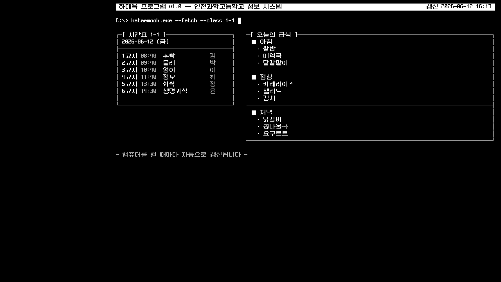

# schoollunch — 인천과학고 급식·시간표 바탕화면 프로그램

A desktop app for students of Incheon Science High School (인천과학고등학교) that
fetches the day's school meal menu and class timetable, renders them as a retro
terminal-style image, and sets it as the desktop wallpaper. Runs on Windows and
macOS. Originally built by Taewook Ha (class of 33).




## What it does

- **Meal menu** — pulls breakfast/lunch/dinner from the NEIS open education
  portal API (no API key required). Falls back to a weekly query, then to the
  last cached response, if a request fails.
- **Timetable** — fetches today's timetable for the selected class (1-1 to 1-4)
  from 컴시간알리미 (comci.net). On weekends it shows the coming Monday. The
  server's data key rotates periodically, so the app extracts it dynamically on
  every run instead of hardcoding it.
- **Wallpaper rendering** — detects the monitor resolution and draws a
  character-grid, pixel-font (Neodgm) terminal screen with Pillow. The left
  ~23% of the screen is kept clear for desktop icons. A background image chosen
  in settings is dimmed and laid underneath.
- **Themes** — four UI/wallpaper themes: Black on white, White on black,
  Crayon sketch, and Cyber Terminal.
- **App UI** — one Tkinter window for class/theme/background/autostart
  settings, timetable editing, image generation, wallpaper application, and
  meal/timetable preview. Includes a custom background layout editor with
  drag-and-drop panels and pen strokes.
- **Autostart** — registers a Windows Run registry key or a macOS user
  LaunchAgent. If the network is not up yet at boot, it retries every 10
  seconds for up to 5 minutes.
- **System tray** — after refreshing, the app stays in the tray (Refresh now /
  Settings / Quit). Refresh happens once at boot; there is no periodic refresh.

## Repository layout

All source code lives in the `개발용` ("development") directory:

```
개발용/
├── main.py              entry point: app UI, or background refresh + tray
├── app_ui.py            full application window (settings, preview, apply)
├── fetch_meal.py        NEIS meal API client with weekly/cache fallback
├── fetch_timetable.py   comci.net timetable client (dynamic key extraction)
├── render.py            retro TUI wallpaper renderer (Pillow)
├── custom_editor.py     custom background layout editor
├── settings_ui.py       compatibility wrapper for older UI callers
├── ui_common.py         shared theme palettes, fonts, themed widgets
├── wallpaper.py         wallpaper application (Win32 / macOS System Events)
├── autostart.py         Run key / LaunchAgent registration
├── config.py            settings, cache, logs
├── build.bat            Windows build (cmd)
├── build.ps1            Windows build (PowerShell)
├── build_macos.sh       macOS app bundle build
├── test_app.py          logic-level tests (fallbacks, corrupt config, render)
├── test_ui.py           UI stress test
└── assets/              fonts (Neodgm) and app icons (.ico / .icns)
```

Settings, cache, and logs are stored per user in
`%APPDATA%\하태욱프로그램\` on Windows and `~/.config/하태욱프로그램/` on macOS.

## Tech stack

Python 3.10+, Tkinter (UI), Pillow (rendering), pystray (system tray),
requests (APIs), PyInstaller (packaging), pyobjc-framework-Cocoa (macOS only).

## Quick start

From source (macOS or Windows with Python installed):

```bash
cd 개발용
python3 -m venv .venv
.venv/bin/pip install -r requirements.txt   # Windows: .venv\Scripts\pip install -r requirements.txt
.venv/bin/python main.py
```

Useful modes: `--ui` (settings window only), `--render-only` (write the
wallpaper PNG and exit), `--once` (refresh once and exit),
`--once --no-wallpaper` (render without touching the desktop),
`--background` (refresh and stay in the tray).

To build standalone executables (`dist\하태욱 프로그램.exe` on Windows,
`dist-macos/하태욱 프로그램.app` on macOS), see [SETUP.md](SETUP.md).

## Status

Actively used and maintained by its author. The detailed Korean-language
documentation is in [개발용/README.md](개발용/README.md). Known issues are
tracked in [개발용/BUG_LOG_2026-06-13.md](개발용/BUG_LOG_2026-06-13.md).
