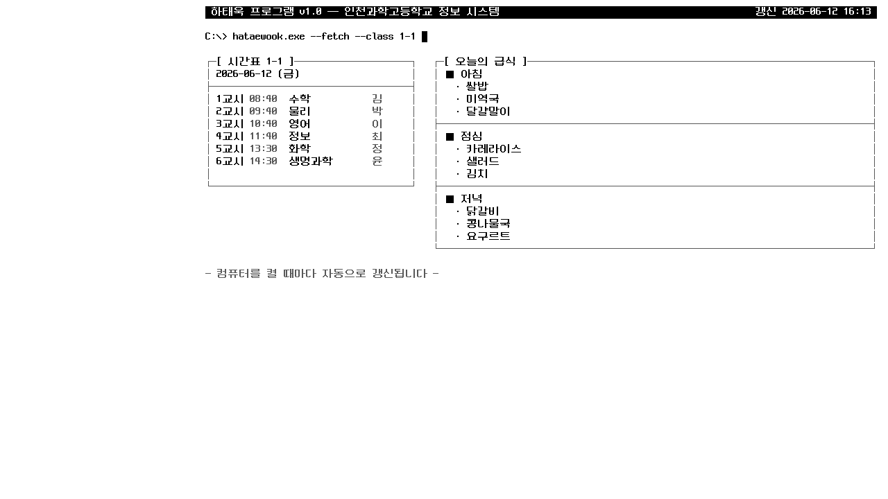
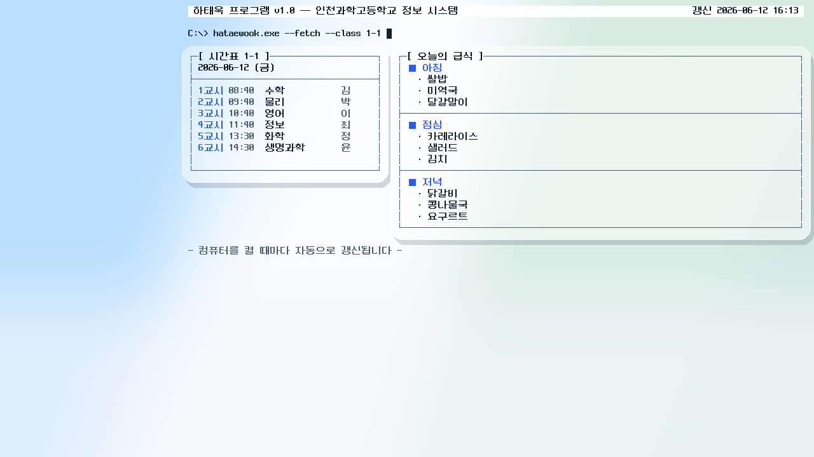

# 하태욱 프로그램.exe

인천과학고등학교의 **급식**과 **시간표**를 자동으로 가져와서, 레트로 터미널(TUI)
스타일의 바탕화면을 만들어 적용하는 Windows/macOS 프로그램.





## 기능

- **급식**: NEIS 교육정보 개방포털 급식 API에서 아침/점심/저녁을 가져온다
  (API 키 불필요). 실패 시 주간 조회 → 마지막 캐시 순으로 fallback.
- **시간표**: 컴시간알리미에서 선택한 반(1-1 ~ 1-4)의 오늘 시간표를 가져온다.
  주말이면 다가오는 월요일 시간표를 표시. 서버의 자료 키가 주기적으로 바뀌어도
  매번 동적으로 추출하므로 깨지지 않는다.
- **바탕화면**: 모니터 해상도를 자동 감지해 픽셀 폰트(네오둥근모) 기반의
  터미널 화면을 그린다. 왼쪽 약 23%는 바탕화면 아이콘 자리로 비워 둔다.
  설정에서 배경 이미지를 고르면 어둡게 깔린다.
- **UI 테마**: 설정에서 Black on white / White on black / Liquid glass 중
  하나를 선택해 바탕화면과 설정창 스타일을 바꿀 수 있다.
- **애플리케이션 UI**: 반/테마/배경/자동 실행 설정, 이미지 생성, 바탕화면 적용,
  급식/시간표 확인을 한 창에서 처리한다.
- **자동 실행**: Windows는 레지스트리 Run 키, macOS는 사용자 LaunchAgent로
  시작 시 자동 실행. 부팅 직후 인터넷이 안 붙어 있으면 최대 5분간 10초 간격으로 재시도.
- **트레이**: 갱신 후 트레이에 상주. 메뉴 — 지금 갱신 / 설정 / 종료.
  갱신은 부팅 시 1회가 기본 (주기적 갱신 없음).

## 빌드 (Windows)

명령 프롬프트(cmd):

```bat
pip install -r requirements.txt
build.bat
```

PowerShell:

```powershell
pip install -r requirements.txt
.\build.ps1
```

> 실행 정책 때문에 `.\build.ps1`이 막히면:
> `powershell -ExecutionPolicy Bypass -File build.ps1`

→ `dist\하태욱 프로그램.exe` 생성. 처음 실행하면 설정창이 떠서 반을 고른다.
실행 파일 아이콘은 `assets/icons/app_icon.ico`를 사용한다.

## 빌드 (macOS)

```bash
python3 -m venv .venv
.venv/bin/pip install -r requirements.txt
./build_macos.sh
```

→ `dist-macos/하태욱 프로그램.app` 생성. 앱 아이콘은 `assets/icons/app_icon.icns`를 사용한다.

## 실행 (macOS)

macOS에서는 Python으로 바로 실행할 수 있다.

```bash
python3 -m venv .venv
.venv/bin/pip install -r requirements.txt
.venv/bin/python main.py
```

실행하면 전체 애플리케이션 UI가 뜬다. 여기서 설정 저장, 이미지 생성, 바탕화면 적용,
급식/시간표 확인을 할 수 있다.

바탕화면 적용은 지원된다. 내부적으로 macOS `System Events`를 사용하므로 처음 실행할 때
자동화/접근성 권한 확인이 뜰 수 있다. macOS 권한, 회사/학교 관리 정책, 또는 데스크탑
환경 제한 때문에 바탕화면 적용이 막히면 이미지 생성까지만 실행할 수 있다.

```bash
.venv/bin/python main.py --render-only
```

위 명령은 `~/.config/하태욱프로그램/wallpaper.png`까지 만들고 종료한다. 생성된 이미지만
확인하면서 테스트하려면 이 모드를 쓰면 된다.

전체 애플리케이션 UI만 열기:

```bash
.venv/bin/python main.py --ui
```

UI 없이 갱신 후 트레이에 상주:

```bash
.venv/bin/python main.py --background
```

트레이 없이 한 번 갱신하고 바탕화면 적용까지 시도한 뒤 종료:

```bash
.venv/bin/python main.py --once
```

이미지는 만들지만 바탕화면은 건드리지 않고 한 번만 실행:

```bash
.venv/bin/python main.py --once --no-wallpaper
```

## 개발/테스트 (모든 OS)

```bash
python -m venv .venv && .venv/bin/pip install -r requirements.txt
.venv/bin/python fetch_meal.py        # 급식 fetch 단독 테스트
.venv/bin/python fetch_timetable.py   # 시간표 fetch 단독 테스트
.venv/bin/python render.py            # preview.png 생성 (1920×1080)
```

## 파일 구조

| 파일 | 역할 |
|---|---|
| `main.py` | 진입점: UI 실행 또는 백그라운드 갱신/트레이 상주 |
| `app_ui.py` | 설정·급식/시간표·바탕화면 적용을 제공하는 전체 앱 UI |
| `fetch_meal.py` | NEIS 급식 API (키 없이) + 주간 조회/캐시 fallback |
| `fetch_timetable.py` | 컴시간알리미 비공식 API 동적 파싱 |
| `render.py` | 문자 격자 기반 레트로 TUI 바탕화면 렌더러 (Pillow) |
| `settings_ui.py` | 기존 호출 호환용 UI 래퍼 |
| `ui_common.py` | 공용 UI 테마 (팔레트·폰트·macOS 호환 ThemedButton) |
| `wallpaper.py` | Windows/macOS 바탕화면 적용 |
| `autostart.py` | Windows Run 키 / macOS LaunchAgent 자동 시작 등록 |
| `config.py` | 설정·캐시·로그 (`%APPDATA%\하태욱프로그램\`) |
| `assets/fonts/neodgm.ttf` | 네오둥근모 픽셀 폰트 (자유 라이선스) |
| `assets/icons/app_icon.ico` | Windows 실행 파일 아이콘 |
| `assets/icons/app_icon.icns` | macOS 앱 번들 아이콘 |

## 참고

- 학교 공식 홈페이지(i-science.icehs.kr)는 JS 렌더링이라 단순 스크래핑이
  불가능해서, 급식 fallback은 NEIS 주간 조회 + 캐시로 구현했다. NEIS가
  공식 급식 데이터 제공처이므로 데이터는 동일하다.
- 설정·캐시·로그 위치: `%APPDATA%\하태욱프로그램\` (macOS 테스트 시 `~/.config/하태욱프로그램/`)
